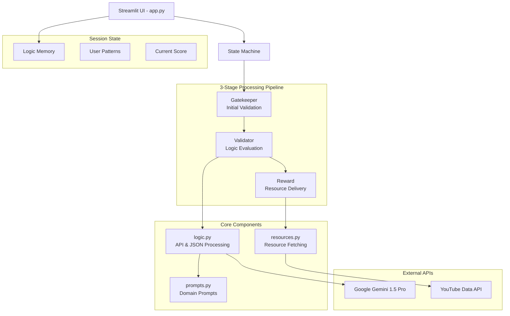
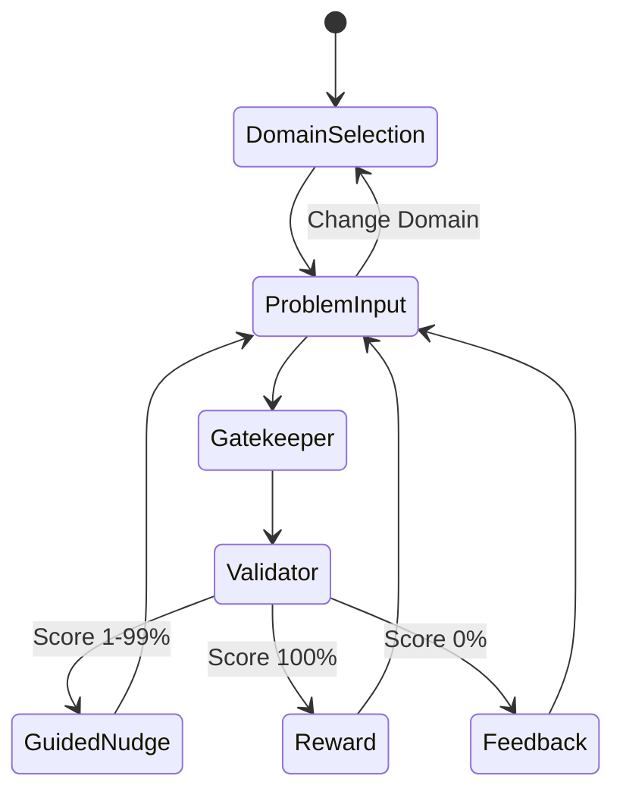

# Design Document: Tark 2.0 Logic Engine

## Overview

Tark 2.0 (The Logic Engine) is a Streamlit-based educational platform that teaches reasoning through AI-powered evaluation and adaptive feedback. The system implements a 3-stage processing pipeline (Gatekeeper → Validator → Reward) to evaluate user logic, detect assumptions, and provide contextual learning resources across coding, finance, and hardware domains.

The platform refuses to provide answers until users demonstrate logical thinking, using partial credit scoring and personalized nudges to guide learning progression.

## Architecture

### System Architecture Overview



### Monolithic Streamlit Architecture

The application follows a monolithic Streamlit architecture with clear separation of concerns:

- **app.py**: Main UI controller with session state management
- **logic.py**: Business logic layer handling AI interactions and JSON processing
- **prompts.py**: Domain-specific prompt templates and persona instructions
- **resources.py**: Resource fetching and ranking functionality

### 3-Stage Processing Flow

1. **Gatekeeper Stage**: Initial validation of user input and domain classification
2. **Validator Stage**: Core logic evaluation producing structured JSON output
3. **Reward Stage**: Resource fetching and solution unlocking (triggered only on 100% score)

## Components and Interfaces

### 1. Main Application Controller (app.py)

**Responsibilities:**
- Streamlit UI rendering and user interaction handling
- Session state management and Logic Memory persistence
- Orchestration of the 3-stage processing pipeline
- User interface state transitions and visual feedback

**Key Functions:**
```python
def initialize_session() -> None
def render_problem_input() -> str
def render_feedback_display(evaluation_result: EvaluationResult) -> None
def handle_domain_selection() -> Domain
def manage_session_state() -> SessionState
```

**Session State Schema:**
```python
@dataclass
class SessionState:
    current_domain: Domain
    logic_memory: LogicMemory
    current_problem: Optional[str]
    evaluation_history: List[EvaluationResult]
    session_id: str
    is_active: bool
```

### 2. Logic Processing Engine (logic.py)

**Responsibilities:**
- Google Gemini 1.5 Pro API integration
- JSON response parsing and validation
- Logic evaluation orchestration
- Error handling and fallback responses

**Key Functions:**
```python
def evaluate_reasoning(user_input: str, domain: Domain, memory: LogicMemory) -> EvaluationResult
def call_gemini_api(prompt: str, system_context: str) -> str
def parse_evaluation_json(response: str) -> EvaluationResult
def handle_api_errors(error: Exception) -> EvaluationResult
```

**API Integration Pattern:**
- Structured prompts with domain-specific context
- JSON schema enforcement for consistent responses
- Rate limiting and retry logic
- Graceful degradation on API failures

### 3. Domain Prompt Management (prompts.py)

**Responsibilities:**
- Domain-specific system prompts (Coding, Finance, Hardware)
- Persona instructions for consistent AI behavior
- Evaluation criteria templates
- Guided nudge generation templates

**Prompt Structure:**
```python
@dataclass
class DomainPrompt:
    persona_instructions: str
    evaluation_criteria: str
    scoring_rubric: str
    nudge_templates: Dict[str, str]
    assumption_detection_guide: str
```

**Domain-Specific Personas:**
- **Coding**: Senior software engineer focused on algorithmic thinking
- **Finance**: Financial analyst emphasizing risk assessment and quantitative reasoning
- **Hardware**: Systems engineer prioritizing technical constraints and trade-offs

### 4. Resource Management (resources.py)

**Responsibilities:**
- YouTube Data API integration
- Resource ranking by difficulty and relevance
- Mock data handling for development/testing
- Resource metadata extraction

**Key Functions:**
```python
def fetch_youtube_resources(query: str, domain: Domain) -> List[Resource]
def rank_resources_by_difficulty(resources: List[Resource]) -> List[Resource]
def rank_resources_by_relevance(resources: List[Resource], problem_context: str) -> List[Resource]
def get_mock_resources(domain: Domain) -> List[Resource]
```

## Data Models and Schemas

### Core Evaluation Response Schema

```json
{
  "logic_score": {
    "type": "integer",
    "minimum": 0,
    "maximum": 100,
    "description": "Percentage score of reasoning quality"
  },
  "assumptions_detected": {
    "type": "array",
    "items": {
      "type": "object",
      "properties": {
        "assumption": {"type": "string"},
        "explanation": {"type": "string"},
        "validity": {"type": "string", "enum": ["reasonable", "problematic", "invalid"]}
      }
    }
  },
  "expert_comparison": {
    "type": "object",
    "properties": {
      "expert_reasoning": {"type": "string"},
      "key_differences": {"type": "array", "items": {"type": "string"}},
      "improvement_areas": {"type": "array", "items": {"type": "string"}}
    }
  },
  "guided_nudges": {
    "type": "array",
    "items": {
      "type": "object",
      "properties": {
        "correct_elements": {"type": "array", "items": {"type": "string"}},
        "improvement_hints": {"type": "array", "items": {"type": "string"}},
        "next_steps": {"type": "string"}
      }
    }
  },
  "ranked_resources": {
    "type": "array",
    "items": {
      "type": "object",
      "properties": {
        "title": {"type": "string"},
        "url": {"type": "string"},
        "difficulty": {"type": "string", "enum": ["Beginner", "Intermediate", "Advanced"]},
        "relevance_score": {"type": "number", "minimum": 0, "maximum": 1},
        "resource_type": {"type": "string", "enum": ["video", "article", "tutorial"]}
      }
    }
  }
}
```

### Logic Memory Schema

```python
@dataclass
class LogicMemory:
    session_id: str
    reasoning_patterns: List[ReasoningPattern]
    common_mistakes: List[str]
    strength_areas: List[str]
    adaptation_level: int  # 0-5 scale
    
@dataclass
class ReasoningPattern:
    pattern_type: str  # "assumption_heavy", "edge_case_blind", "incomplete_analysis"
    frequency: int
    examples: List[str]
    improvement_suggestions: List[str]
```

### Resource Schema

```python
@dataclass
class Resource:
    title: str
    url: str
    difficulty: Difficulty  # Enum: BEGINNER, INTERMEDIATE, ADVANCED
    relevance_score: float  # 0.0 to 1.0
    resource_type: ResourceType  # Enum: VIDEO, ARTICLE, TUTORIAL
    domain: Domain
    metadata: Dict[str, Any]
```

## API Integrations

### Google Gemini 1.5 Pro Integration

**Configuration:**
- Model: gemini-1.5-pro
- Temperature: 0.3 (for consistent evaluation)
- Max tokens: 2048
- JSON mode enabled for structured responses

**Request Pattern:**
```python
def build_evaluation_request(user_reasoning: str, domain: Domain, memory: LogicMemory) -> dict:
    return {
        "model": "gemini-1.5-pro",
        "messages": [
            {"role": "system", "content": get_domain_prompt(domain)},
            {"role": "user", "content": format_evaluation_prompt(user_reasoning, memory)}
        ],
        "response_format": {"type": "json_object"},
        "temperature": 0.3
    }
```

**Error Handling:**
- Rate limit retry with exponential backoff
- Fallback to simplified evaluation on JSON parsing errors
- Graceful degradation with cached responses

### YouTube Data API Integration

**Configuration:**
- API Version: v3
- Search endpoint for video discovery
- Quota management for sustainable usage

**Search Strategy:**
```python
def build_youtube_query(problem_domain: Domain, logic_score: int, user_context: str) -> str:
    base_terms = DOMAIN_SEARCH_TERMS[problem_domain]
    difficulty_modifier = "beginner" if logic_score < 70 else "advanced"
    return f"{base_terms} {difficulty_modifier} tutorial explanation"
```

## State Management

### Session State Architecture

Streamlit's session state manages:
- **Current Domain**: Active problem domain (coding/finance/hardware)
- **Logic Memory**: User pattern tracking and adaptation data
- **Evaluation History**: Previous reasoning attempts and scores
- **UI State**: Current stage in the 3-stage pipeline
- **Resource Cache**: Fetched resources to avoid redundant API calls

### State Transitions



### Memory Management

**Logic Memory Lifecycle:**
1. **Initialization**: Empty pattern tracking on session start
2. **Accumulation**: Pattern detection and storage during reasoning attempts
3. **Adaptation**: Feedback personalization based on detected patterns
4. **Reset**: Complete memory clearing on session end

## User Interface Design

### Layout Structure

**Main Interface Components:**
1. **Header**: Domain selector and session status
2. **Problem Area**: Problem statement and context
3. **Input Section**: Reasoning text area with submission controls
4. **Feedback Panel**: Dynamic content based on evaluation stage
5. **Progress Indicator**: Visual representation of logic score and session progress

### Visual Feedback System

**Score-Based UI States:**
- **0% Score**: Red indicators, fundamental error messaging
- **1-99% Score**: Yellow/orange indicators, guided nudge display
- **100% Score**: Green indicators, expert comparison and resource unlock

**Guided Nudge Display:**
```
✅ Correct Elements:
• [Highlighted correct reasoning parts]

🎯 Areas for Improvement:
• [Specific improvement hints]

➡️ Next Steps:
[Actionable guidance without revealing solution]
```

**Expert Comparison Layout:**
```
Your Reasoning          |  Expert Reasoning
[User's logic]          |  [Expert's logic]
                        |
Key Differences:
• [Difference 1]
• [Difference 2]
```

### Responsive Design Considerations

- Mobile-friendly text input areas
- Collapsible sections for complex feedback
- Progressive disclosure of information based on score
- Accessibility compliance for screen readers

## Error Handling

### API Error Management

**Gemini API Errors:**
- Rate limiting: Exponential backoff with user notification
- JSON parsing failures: Fallback to text-based evaluation
- Network timeouts: Cached response delivery when available
- Authentication errors: Clear user messaging and admin notification

**YouTube API Errors:**
- Quota exceeded: Switch to mock resource delivery
- Search failures: Fallback to curated resource lists
- Network issues: Display cached resources from previous sessions

### User Input Validation

**Input Sanitization:**
- XSS prevention for text inputs
- Length limits to prevent API overload
- Content filtering for inappropriate submissions
- Encoding validation for special characters

**Graceful Degradation:**
- Simplified evaluation when full AI processing fails
- Static resource recommendations when API is unavailable
- Basic scoring when advanced features are down

## Performance Considerations

### Caching Strategy

**Response Caching:**
- Gemini API responses cached by input hash
- YouTube search results cached by query
- Expert logic comparisons pre-computed for common problems
- Resource rankings cached by domain and difficulty

**Session Optimization:**
- Lazy loading of resources until 100% score achieved
- Incremental pattern analysis to avoid reprocessing
- Efficient state serialization for session persistence

### Scalability Planning

**Current Monolithic Limitations:**
- Single-user session state in Streamlit
- In-memory caching without persistence
- Direct API calls without queuing

**Future Scalability Considerations:**
- Database integration for persistent Logic Memory
- Redis caching for multi-user resource sharing
- API gateway for rate limiting and load balancing

## Correctness Properties

*A property is a characteristic or behavior that should hold true across all valid executions of a system—essentially, a formal statement about what the system should do. Properties serve as the bridge between human-readable specifications and machine-verifiable correctness guarantees.*

### Property 1: Logic Score Range Validation
*For any* user reasoning input, the Logic_Engine should assign a Logic_Score between 0 and 100 inclusive
**Validates: Requirements 1.1**

### Property 2: Guided Nudges for Partial Scores
*For any* user reasoning that receives a Logic_Score between 1-99%, the Logic_Engine should generate Guided_Nudges containing correct elements and improvement hints
**Validates: Requirements 1.3, 2.1**

### Property 3: Score-Based Nudge Differentiation
*For any* two reasoning inputs with Logic_Scores in different ranges (e.g., 20% vs 80%), the generated Guided_Nudges should have different content tailored to the score range
**Validates: Requirements 2.4**

### Property 4: Nudge Solution Preservation
*For any* Guided_Nudge generated for partial scores, the nudge content should not contain complete solution keywords or reveal the full answer
**Validates: Requirements 2.3**

### Property 5: Assumption Detection Consistency
*For any* reasoning input containing unstated assumptions, the Assumption_Detector should identify and explicitly state those assumptions with explanations
**Validates: Requirements 3.1, 3.2, 3.3**

### Property 6: Assumption Classification Accuracy
*For any* detected assumption, the Assumption_Detector should classify it as reasonable, problematic, or invalid based on logical validity
**Validates: Requirements 3.4**

### Property 7: Logic Memory Pattern Storage
*For any* user reasoning submitted during an active session, the Logic_Memory should analyze and store identifiable patterns in the user's logical approach
**Validates: Requirements 4.2, 10.2**

### Property 8: Pattern-Based Feedback Adaptation
*For any* user with detected reasoning patterns in Logic_Memory, subsequent feedback should be adapted to address those specific thinking tendencies
**Validates: Requirements 4.3**

### Property 9: Expert Comparison Content Structure
*For any* 100% Logic_Score achievement, the expert comparison should highlight key differences and explain why the expert approach is effective
**Validates: Requirements 5.2, 5.3**

### Property 10: Domain-Appropriate Expert Logic
*For any* problem in a specific domain (coding/finance/hardware), the Expert_Logic should be appropriate to that domain and represent best practices
**Validates: Requirements 5.4**

### Property 11: Resource Ranking by Difficulty
*For any* set of fetched resources, the Resource_Ranker should order them by difficulty level (Beginner/Intermediate/Advanced) with clear indicators
**Validates: Requirements 6.2, 6.5**

### Property 12: Resource Ranking by Relevance
*For any* set of fetched resources for a specific problem domain, the Resource_Ranker should order them by relevance score to that domain
**Validates: Requirements 6.3, 6.5**

### Property 13: Domain-Specific Evaluation Criteria
*For any* problem submitted in different domains (coding vs finance vs hardware), the Logic_Engine should apply domain-appropriate evaluation criteria while maintaining consistent scoring methodology
**Validates: Requirements 7.1, 7.2, 7.3, 7.4, 7.5**

### Property 14: UI Visual Distinction
*For any* feedback type (Logic_Score, Guided_Nudges, Expert_Logic), the User_Interface should display each with distinct visual styling and layout
**Validates: Requirements 8.2, 8.3, 8.4**

### Property 15: API Integration Reliability
*For any* reasoning evaluation request, the Logic_Engine should successfully integrate with Google Gemini 1.5 Pro API and the Resource_Ranker should integrate with YouTube Data API
**Validates: Requirements 9.1, 6.4, 9.2**

### Property 16: API Error Handling
*For any* API failure or invalid response, the Logic_Engine should provide graceful error handling with fallback responses and proper validation
**Validates: Requirements 9.3, 9.5**

### Property 17: API Rate Limiting
*For any* sequence of rapid API requests, the Logic_Engine should implement appropriate rate limiting to prevent API quota exhaustion
**Validates: Requirements 9.4**

### Property 18: Session State Persistence
*For any* active learning session, the Logic_Engine should maintain consistent session state and Logic_Memory throughout the user's interaction period
**Validates: Requirements 10.5**

### Property 19: JSON Response Structure Validation
*For any* API response from Google Gemini, the logic.py module should validate the JSON structure matches the expected schema before processing
**Validates: Requirements 9.5**

### Property 20: Cross-Domain Scoring Consistency
*For any* two reasoning inputs of similar logical quality in different domains, the Logic_Scores should be comparable despite domain-specific evaluation criteria
**Validates: Requirements 7.5**

## Testing Strategy

### Dual Testing Approach

The Tark 2.0 Logic Engine requires both unit testing and property-based testing for comprehensive validation:

**Unit Tests** focus on:
- Specific examples of 0% and 100% Logic_Score scenarios
- Session initialization and cleanup behavior
- UI component rendering and interaction
- API integration with mock responses
- Edge cases like empty inputs or malformed JSON

**Property Tests** focus on:
- Universal properties across all reasoning inputs
- Logic_Score range validation (0-100%)
- Guided nudge generation consistency
- Assumption detection across varied inputs
- Resource ranking behavior
- Cross-domain evaluation consistency

### Property-Based Testing Configuration

**Testing Framework**: Hypothesis (Python) for property-based testing
**Test Configuration**:
- Minimum 100 iterations per property test
- Custom generators for reasoning inputs, domains, and user patterns
- Shrinking enabled for minimal failing examples

**Test Tagging Format**:
Each property test must include a comment referencing the design property:
```python
# Feature: tark-2-logic-engine, Property 1: Logic Score Range Validation
def test_logic_score_range_property(reasoning_input):
    score = logic_engine.evaluate_reasoning(reasoning_input)
    assert 0 <= score.logic_score <= 100
```

### Integration Testing Strategy

**API Integration Tests**:
- Mock Google Gemini responses with various JSON structures
- Mock YouTube API responses with different resource types
- Test rate limiting behavior with rapid request simulation
- Validate error handling with simulated API failures

**Session Management Tests**:
- Test Logic_Memory persistence across multiple reasoning attempts
- Validate session cleanup on application termination
- Test pattern detection and adaptation over time

**UI Integration Tests**:
- Test complete user flows from input to feedback display
- Validate visual distinction between different feedback types
- Test domain switching and state management

### Performance Testing Considerations

**Load Testing**:
- Simulate multiple concurrent reasoning evaluations
- Test API rate limiting under high load
- Validate session state management with multiple users

**Response Time Testing**:
- Measure Gemini API response times for various input lengths
- Test YouTube resource fetching performance
- Validate UI responsiveness during processing

### Test Data Management

**Synthetic Data Generation**:
- Generate reasoning inputs across all three domains
- Create varied assumption patterns for detection testing
- Generate resource metadata for ranking validation

**Mock API Responses**:
- Pre-defined Gemini responses for consistent testing
- Mock YouTube search results with known difficulty rankings
- Error response scenarios for resilience testing